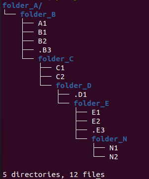

File Watcher Features
=====================

The **Watcher** module has been designed with the typical use cases of the Banking 
and Telecommunications industry in mind for *IT Batch Processing*.

If you know of a use case that is not covered by watcher, 
please tell us about it in the 
`GitHub Discussions Section <https://github.com/racherb/watcher/discussions/categories/ideas/>`_ .

Currently **Watcher** comprises the following features: 
:ref:`Single File & Folders`, 
:ref:`Multiples File Groups`,
:ref:`File Patterns`,
:ref:`Non-Bloking Execution`, 
:ref:`Bloking Execution`,
:ref:`Bulk File Processing`, 
:ref:`Advanced File Deletion`, 
:ref:`Advanced File Creation`, 
:ref:`Advanced File Alteration`, 
:ref:`Watcher for Any Alteration`,
:ref:`Watcher for Specific Alteration`,
:ref:`Decoupled Execution`,
:ref:`Novelty Detection`,
:ref:`Qualitative Response`,
:ref:`Check File Stability`,
:ref:`Big Amounts of Files`,
:ref:`Atomic Function Injection`,
:ref:`Folder Recursion`,
:ref:`Selective Path Level`,
:ref:`Watcher Monitoring`

.. note::
   The lines of code used to exemplify each feature of watcher assume the following: 

   .. code-block:: lua
      :linenos:
      
      fwa = require('watcher').file   --for file-watcher
      mon = require('watcher').monit  --for watcher monitoring

.. _Single File & Folders:

Single File & Folders
----------------------

Detection of ``creation``, ``deletion`` and ``alteration`` of **single files** or **single folders** in the file system.

.. code-block:: lua
   :linenos:

   fwa.creation({'/path/to/single_file'})    --watching file creation
   fwa.creation({'/path/to/single_folder/'}) --watching folder creation

.. _Multiples File Groups:

Multiples File Groups
---------------------

Multiple groups of different files can be watched at the same time.
The input list of watchable files is a Lua table type parameter.

.. code-block:: lua
   :linenos:
   :emphasize-lines: 3,4

   fwa.deletion(
       {
           '/path_1/to/group_file_a/*',  --folder
           '/path_2/to/group_file_b/*'   --another
        }
    )

.. _File Patterns:

File Patterns
--------------

.. code-block:: lua

   fwa.creation({'/path/to/files_*.txt'})

.. note::
   The *watch-list* is constructed with a single flag that controls the behavior of the function: **GLOB_NOESCAPE**. 
   For details type ``man 3 glob``.

.. _Non-Bloking Execution:

Non-Bloking Execution
---------------------

By default the **Watcher** run is executed in non-blocking mode through tarantool fibers. 
Fibers are a unique Tarantool feature *"green threads"* or coroutines that run independently 
of operating system threads.

.. _Bloking Execution:

Blocking Execution
------------------

The ``waitfor`` function blocks the code and waits for a watcher to finish.

.. code-block:: lua

   waitfor(fwa.creation({'/path/to/file'}).wid) --wait for watcher

.. _Bulk File Processing:

Bulk File Processing
--------------------

**Watcher** has an internal mechanism to allocate fibers for every certain amount of files 
in the watcher list. This amount is determined by the ``BULK_CAPACITY`` configuration value 
in order to optimize performance.

.. _Advanced File Deletion:

Advanced File Deletion
----------------------

Inputs
******

.. list-table:: File Watcher Deletion Parameters
   :widths: 25 25 50
   :header-rows: 1

   * - Param
     - Type
     - Description
   * - wlist
     - ``table``, ``required``
     - Watch List
   * - maxwait
     - ``number``, ``otional``, ``default-value: 60``
     - Maximum wait time in seconds
   * - interval
     - ``number``, ``otional``, ``default-value: 0.5``
     - Verification interval for watcher in seconds
   * - options
     - ``table``, ``optional``, ``default-value: {'NS', 0, 0}``
     - List of search options
   * - recursion
     - ``table``, ``optional``, ``default-value: nil`` or ``{false, {0}, false}``
     - Recursion paramaters

wlist
*****

It is the list of files, directories or file patterns to be observed. The data type is a Lua table and 
the size of tables is already limited to ``2.147.483.647`` elements.

An example definition is the following:

.. code-block:: lua
   
   wlist = {'path/file', 'path', 'pattern*', ...} --arbitrary code

maxwait
*******

Maxwait is a numeric value that represents the maximum time to wait for the watcher. 
Watcher will terminate as soon as possible and as long as the search conditions are met. 
The default value is ``60 seconds``. 

interval
********

Interval is a numerical value that determines how often the watcher checks the search conditions. 
This value must be less than the maxwait value. 
The default value is ``0.5`` seconds.

options
*******
The options parameter is a Lua table containing 3 elements: ``sort``, ``cases`` and ``match``.

* The first one ``sort`` contains the ordering method of the ``wlist``. 
* The second element ``cases`` contains the number of cases to observe from the wlist.
* and the third element ``match`` indicates the number of cases expected to satisfy the search. 

By default, the value of the option table is ``{sort = 'NS', cases = 0, match = 0}``.

.. list-table:: The list of possible values for ``sort``
   :widths: 12 50
   :header-rows: 1

   * - Value
     - Description
   * - ``'NS'``
     - No sort
   * - ``'AA'``
     - Sorted alphabetically ascending
   * - ``'AD'``
     - Sorted alphabetically descending
   * - ``'MA'``
     - Sorted by date of modification ascending
   * - ``'MD'``
     - Sorted for date of modification descending

.. note::

   The value ``'NS'`` treats the list in the same order in which the elements 
   are passed to the list ``wlist``.

recursion
*********

To enable directory recursion you must define the recursion parameter. 
The recursion works only for an observable of type directory.

The recursion value is a Lua table type composed of the following elements ``{recursive_mode, {deep_levels}, hidden_files}``:

* **recursive_mode**: Boolean indicating whether or not to activate the recursive mode on the root directory. The default value is ``false``.
* **deep_levels**: Numerical table indicating the levels of depth to be evaluated in the directory structure. The default value is ``{0}``
* **hidden_files**: Boolean indicating whether hidden files will be evaluated in the recursion. The default value is ``false``.

.. _How do the recursion levels work:

How do the recursion levels work?
*********************************

To understand how levels work in recursion, let's look at the following example.

Imagine you have the following directory structure and you want to observe 
the deletion of files from the path **'/folder_A/folder_B/'**. 

The levels are determined from the object path or root path that will be used as input 
in the watcher expression. In this case the path **'/folder_A/folder_B/'** has level zero and, 
for each folder node a level will be added according to its depth. 
The result is shown in the following summary table, which contains the list of files 
for each level. 

.. list-table:: Identification of the levels of recursion
   :widths: 7 20 8 8 8 8
   :header-rows: 1

   * - 
     - [Input] Level 0 ``{0}``
     - Level 1 ``{1}``
     - Level 2 ``{2}``
     - Level 3 ``{3}``
     - Level 4 ``{4}``
   * - **folder**
     - ``'/folder_A/folder_B/'``
     - ``'folder_C'``
     - ``'folder_D'``
     - ``'folder_E'``
     - ``'folder_N'``
   * - **files**
     - ``{A1}`` ``{B1, B2, .B3}``
     - ``{C1, C2}``
     - ``{.D1}``
     - ``{E1, E2, .E3}``
     - ``{N1, N2}``

.. note::
   
   The files, ``.B3``, ``.D1`` and ``.E3`` are hidden files.

Now that we know how to set the recursion level, let's see an example of the 
observable files depending on different values of the **recursion** parameter 
for the above mentioned example.

.. list-table:: Observable files depending on the recursion level
   :widths: 20 20
   :header-rows: 1

   * - ``recursion`` value
     - Composition of the list of observable files ``wlist``
   * - ``{true, {0}, false}``
     - ``{A1, B1, B2}``
   * - ``{true, {0}, true}``
     - ``{A1, B1, B2, .B3}``
   * - ``{true, {0, 1}, false}``
     - ``{A1, B1, B2, C1, C2}``
   * - ``{true, {0, 1}, true}``
     - ``{A1, B1, B2, .B3, C1, C2}``
   * - ``{true, {2}, false}``
     - ``nil``
   * - ``{true, {2}, true}``
     - ``{.D1}``
   * - ``{true, {0, 1, 2, 3, 4}, false}``
     - ``{A1, B1, B2, C1, C2, E1, E2, N1, N2}``
   * - ``{true, {0, 1, 2, 3, 4}, true}``
     - ``{A1, B1, B2, .B3, C1, C2, .D1, E1, E2, .E3, N1, N2}``

Output
******

.. _Advanced File Creation:

Advanced File Creation
----------------------

Inputs
******

.. list-table:: File Watcher Creation Parameters
   :widths: 25 25 50
   :header-rows: 1

   * - Param
     - Type
     - Description
   * - wlist
     - ``table``, ``required``
     - Watch List
   * - maxwait
     - ``number``, ``otional``, ``default-value: 60``
     - Maximum wait time in seconds
   * - interval
     - ``number``, ``otional``, ``default-value: 0.5``
     - Verification interval for watcher in seconds
   * - minsize
     - ``number``, ``optional``, ``default-value: 0``
     - Value of the minimum expected file size
   * - stability
     - ``table``, ``optional``, ``default-value: {1, 15}``
     - Minimum criteria for measuring file stability
   * - novelty
     - ``table``, ``optional``, ``default-value: {0, 0}``
     - Time interval that determines the validity of the file's novelty
   * - nmatch
     - ``number``, ``optional``, ``default-value: 0``
     - Number of expected files as a search sufficiency condition

wlist
*****

It is the list of files, directories or file patterns to be observed. The data type is a Lua table and 
the size of tables is already limited to ``2.147.483.647`` elements.

An example definition is the following:

.. code-block:: lua
   
   wlist = {'path/file', 'path', 'pattern*', ...} --arbitrary code

maxwait
*******

Maxwait is a numeric value that represents the maximum time to wait for the watcher. 
Watcher will terminate as soon as possible and as long as the search conditions are met. 
The default value is ``60 seconds``. 

interval
********

Interval is a numerical value that determines how often the watcher checks the search conditions. 
This value must be less than the maxwait value. 
The default value is ``0.5`` seconds.

minsize
*******

Minsize is a numerical value representing the minimum expected file size. 
The default value is ``0``, which means that it is sufficient to just generate the file when the minimum size is unknown.

.. important::

   Regardless of whether the expected file size is ``0 Bytes``, 
   watcher will not terminate until the file arrives in its entirety, 
   avoiding edge cases where a file is consumed before the data transfer is complete.

.. _stability:

stability
*********

The ``stability`` parameter contains the elements that allow to evaluate the stability of a file. 
It is a Lua table containing two elements:

* The ``interval`` that defines the frequency of checking the file once it has arrived.
* The number of ``iterations`` used to determine the stability of the file.

The default value is: ``{1, 15}``.

novelty
*******

The ``novelty`` parameter is a two-element Lua table that contains the 
time interval that determines the validity of the file’s novelty.
The default value is ``{0, 0}`` which indicates that the novelty of the file will not be evaluated.

nmatch
******

``nmatch`` is a number of expected files as a search sufficiency condition.

.. _Advanced File Alteration:

Advanced File Alteration
------------------------

Inputs
******

.. list-table:: File Watcher Alteration Parameters
   :widths: 25 25 50
   :header-rows: 1

   * - Param
     - Type
     - Description
   * - wlist
     - ``table``, ``required``
     - Watch List
   * - maxwait
     - ``numeric``, ``otional``, ``default-value: 60``
     - Maximum wait time in seconds
   * - interval
     - ``numeric``, ``otional``, ``default-value: 0.5``
     - Verification interval for watcher in seconds
   * - awhat
     - ``string``, ``optional``, ``default-value: '1'``
     - Type of file alteration to be observed
   * - nmatch
     - ``number``, ``optional``, ``default-value: 0``
     - Number of expected files as a search sufficiency condition

wlist
*****

It is the list of files, directories or file patterns to be observed. The data type is a Lua table and 
the size of tables is already limited to ``2.147.483.647`` elements.

An example definition is the following:

.. code-block:: lua
   
   wlist = {'path/file', 'path', 'pattern*', ...} --arbitrary code

maxwait
*******

Maxwait is a numeric value that represents the maximum time to wait for the watcher. 
Watcher will terminate as soon as possible and as long as the search conditions are met. 
The default value is ``60 seconds``. 

interval
********

Interval is a numerical value that determines how often the watcher checks the search conditions. 
This value must be less than the maxwait value. 
The default value is ``0.5`` seconds.

awhat
*****

Type of file alteration to be observed. See :ref:`File Watcher Alteration Parameters`.

.. _File Watcher Alteration Parameters:

.. list-table:: File Watcher Alteration Parameters
   :widths: 25 10 65
   :header-rows: 1

   * - Type
     - Value
     - Description
   * - ``ANY_ALTERATION``
     - ``'1'``
     - Search for any alteration
   * - ``CONTENT_ALTERATION``
     - ``'2'``
     - Search for content file alteration
   * - ``SIZE_ALTERATION``
     - ``'3'``
     - Search for file size alteration
   * - ``CHANGE_TIME_ALTERATION``
     - ``'4'``
     - Search for file ``ctime`` alteration
   * - ``MODIFICATION_TIME_ALTERATION``
     - ``'5'``
     - Search for file ``mtime`` alteration
   * - ``INODE_ALTERATION``
     - ``'6'``
     - Search for file ``inode`` alteration
   * - ``OWNER_ALTERATION``
     - ``'7'``
     - Search for file ``owner`` alteration
   * - ``GROUP_ALTERATION``
     - ``'8'``
     - Search for file ``group`` alteration

nmatch
******

``nmatch`` is a number of expected files as a search sufficiency condition.

.. _Watcher for Any Alteration:

Watcher for Any Alteration
---------------------------

.. code-block:: lua

   fwa.alteration({'/path/to/file'}, nil, nil, '1')

.. _Watcher for Specific Alteration:

Watcher for Specific Alteration
-------------------------------

.. code-block:: lua
   :linenos:

   fwa.alteration({'/path/to/file'}, nil, nil, '2') --Watcher for content file alteration
   fwa.alteration({'/path/to/file'}, nil, nil, '3') --Watcher for content file size alteration
   fwa.alteration({'/path/to/file'}, nil, nil, '4') --Watcher for content file ctime alteration
   --explore other options for 'awhat' values

See table :ref:`File Watcher Alteration Parameters` for more options.
   
.. _Decoupled Execution:

Decoupled Execution
-------------------

The ``create``, ``run`` function and the ``monit`` options have been decoupled 
for better behavior, overhead relief and versatility of use.

.. _Novelty Detection:

Novelty Detection
------------------

**Watcher** implements the detection of the newness of a file based on the ``mtime`` modification date. 
This is useful to know if file system items have been created in an expected time window.

.. warning::

   Note that the creation of the files may have been done preserving the attributes of the original file. 
   In that case you should consider the novelty rank accordingly.

.. code-block:: lua
   :linenos:
   :emphasize-lines: 4

    date_from  = os.time() - 24*60*60 --One day before the current date
    date_to    = os.time() + 24*60*60 --One day after the current date
    os.execute('touch /tmp/novelty_file.txt') --The file is created on the current date
    fwt.creation({'/tmp/novelty_file.txt'}, 10, nil, 0, nil, {date_from, date_to})

.. note::
    For known dates you can use the Lua function **os.time()** as follows:

   .. code-block:: lua
      :linenos:

        date_from = os.time(
            {
                year = 2020,
                month = 6,
                day = 4,
                hour = 23,
                min = 48,
                sec = 10 
            }
        )

.. _Qualitative Response:

Qualitative Response
--------------------

Watcher leaves a record for each watchable file where it provides qualitative 
nformation about the search result for each of them. 
To explore this information see the :ref:`Watcher Monitoring` ``match`` and ``nomatch`` functions.

.. code-block:: lua
   :linenos:

    NOT_YET_CREATED = '_'               --The file has not yet been created
    FILE_PATTERN = 'P'                  --This is a file pattern
    HAS_BEEN_CREATED = 'C'              --The file has been created
    IS_NOT_NOVELTY = 'N'                --The file is not an expected novelty
    UNSTABLE_SIZE = 'U'                 --The file has an unstable file size
    UNEXPECTED_SIZE = 'S'               --The file size is unexpected
    DISAPPEARED_UNEXPECTEDLY = 'D'      --The file has disappeared unexpectedly
    DELETED = 'X'                       --The file has been deleted
    NOT_EXISTS = 'T'                    --The file does not exist
    NOT_YET_DELETED = 'E'               --The file has not been deleted yet
    NO_ALTERATION = '0'                 --The file has not been modified
    ANY_ALTERATION = '1'                --The file has been modified
    CONTENT_ALTERATION = '2'            --The content of the file has been altered
    SIZE_ALTERATION = '3'               --The file size has been altered
    CHANGE_TIME_ALTERATION = '4'        --The ctime of the file has been altered
    MODIFICATION_TIME_ALTERATION = '5'  --The mtime of the file has been altered
    INODE_ALTERATION = '6'              --The number of inodes has been altered
    OWNER_ALTERATION = '7'              --The owner of the file has changed
    GROUP_ALTERATION = '8'              --The group of the file has changed

.. _Check File Stability:

Check File Stability
--------------------

Enabled only for file creation. 
This feature ensures that the **watcher** terminates once the file creation is completely finished. 
This criterion is independent of the file size.

See usage for parameter :ref:`stability`

.. _Big Amounts of Files:

Big Amounts of Files
--------------------

In the following example, watching the file deletion from the path "/" recursively 
down to depth level 3 (``levels={0,1,2,3}``) yields a total of **163,170 watchable files**. 
Note that the execution takes 85 seconds (on a typical desktop machine) but the maximum timeout 
of the watcher has been specified as low as 10 seconds. 
This means that 88% of the time is consumed in creating the watcher due to recursion.

   .. code-block:: lua
      :linenos:
      :emphasize-lines: 9,13

        tarantool> test=function() local ini=os.time() local fwa=fw.deletion({'/'}, 10, nil, {'NS', nil, 2}, {true, {0,1,2,3}, false}) print(os.time()-ini) print(fwa.wid) end
        tarantool> test()
        85
        1620701962375155ULL
        ---
        tarantool> mon.info(1620701962375155ULL)
        ---
        - ans: true
        match: 72
        what: '{"/"}'
        wid: 1620701962375155
        type: FWD
        nomatch: 163098
        status: completed
        ...

.. _Atomic Function Injection:

Atomic Function Injection
-------------------------

Atomic function injection allows you
to perform specific tasks on each element of the watchable list separately.
In the example, the atomic function afu creates a backup copy for each element of the watchlist.

.. code-block:: lua
   :linenos:

   afu = function(file) os.execute('cp '..file..' '..file..'_backup') end --Atomic Funcion
   cor = require('watcher').core
   wat = cor.create({'/tmp/original.txt'}, 'FWD', afu) --afu is passed as parameter
   res = run_watcher(wat)

.. _Folder Recursion:

Folder Recursion
----------------

You can enable recursion on directories to detect changes in the file system. 
Recursion is enabled based on a directory entry as a parameter that is considered as a 
root directory. Starting from this root directory, considered as level zero, 
you can selectively activate the observation of successive directory levels.

.. code-block:: lua
   :linenos:
   :emphasize-lines: 6,7,8,9,10

    fwa.deletion(
        {'/tmp/folder_1'}, --Observed directory is considered a zero level root directory
        nil,               --Maxwait, nil to take the value by omission
        nil,               --Interval, nil to take the value by omission
        nil,               --Options, nil to take the value by omission 
        {
            true,          --Activate recursion
            {0, 1, 2},     --Levels of directories to be observed (root and levels 1 & 2)
            false          --Includes hidden files
        }
    )

For more info see :ref:`How do the recursion levels work`.

.. _Selective Path Level:

Selective Path Level
--------------------

The recursion levels is a list of numerical values so you can specify (selectively) 
the directory level you want to observe and ignore others. This is useful in situations where the full path 
to the file is unknown but the depth or level of the file is known.

.. code-block:: lua
   :linenos:
   :emphasize-lines: 8

    fwa.deletion(
        {'/bac/invoices'}, 
        nil,               
        nil,               
        nil,                
        {
            true,          --Activate recursion
            {3},           --Selective level 3
            false          --Includes hidden files
        }
    )

See use case ...

.. _Watcher Monitoring:

Watcher Monitoring
------------------

``monit`` for Watcher monitoring allows you to monitor and explore the running status of a watcher.

info
****

The output is a Lua table containing the following elements:

- **ans** is a boolean value containing the response of the watcher. ``true`` means that the watcher has detected the expected changes that are defined in the parameters.
- **match** is the number of cases that match the ``true`` value of **ans**.
- **nomatch** is the number of cases that do not belong to the set of ``true`` **ans**.
- **what** is a string containing the obserbables parameter.
- **wid** is the unique identifier of the watcher.
- **type** is the type of the watcher
- **status** is the execution status of the watcher.

.. code-block:: lua
   :linenos:
      
      mon.info(1620701962375155ULL)

        {
            ans: true
            match: 72
            what: '{"/"}'
            wid: 1620701962375155
            type: 'FWD'
            nomatch: 163098
            status: 'completed'
        }

match
*****

nomatch
*******

